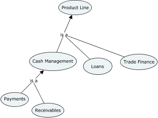

# Building Ontologies from Concept Maps 

## Semantic Web London August 2016

This code is from the inaugural [Semantic Web London](http://www.meetup.com/semantic-web-london/events/232354771/) meetup in August 2016.

I gave a talk about combining ideas of [Concept Mapping](https://en.wikipedia.org/wiki/Concept_map), [Semantic Web](https://en.wikipedia.org/wiki/Semantic_Web) and [Reproducible Research](https://www.coursera.org/learn/reproducible-research) to improve developer and business analyst productivity.

We have considered a use case of drawing up a concept map using [CmapTools](http://cmap.ihmc.us/cmaptools/) and, using a set of scripts, translating it to an ontology that can be used to generate other project artefacts.

## Demo

We used [CmapTools](http://cmap.ihmc.us/cmaptools/) to draw up a basic concept map representing a set of products: 



We then exported it to "Propositions as Text" CmapTools format [demo.txt](demo.txt), run the [demo.py](demo.py) script and got corresponding ontology as an output [demo.ttl](demo.ttl).

You can use [WebVOWL](http://vowl.visualdataweb.org/webvowl/index.html) to visualise the generated ontologies.

## Set up

```
virtualenv venv
. venv/bin/activate
pip install -r requirements.txt
```

## Running the demo

```
python3 demo.py demo.txt demo.ttl
```
